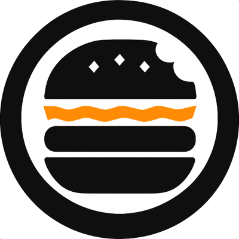

<div
  style="
    display:flex;
    align-items:center;
    justify-content:center;
    gap:20px;
    margin-bottom:20px;
  "
>
  

  <h1
    style="
      color:#111111;
      background:#ff7a00;
      padding:14px 24px;
      border-radius:16px;
      margin:0;
    "
  >
    BurgerEat
  </h1>
</div>

  <p style="color:#111111;background:#fff7f0;padding:16px 20px;border-radius:16px;line-height:1.6;">
    Aplicación web desarrollada con React para la gestión de pedidos de una hamburguesería.
    Está pensada para que un cliente pueda explorar el menú, registrarse, iniciar sesión,
    armar su carrito y consultar sus pedidos, mientras que los perfiles administrativos
    pueden gestionar productos, pedidos y usuarios desde una interfaz simple y clara.
  </p>
</div>

## Vista General

<table>
  <tr>
    <td width="33%">
      
    </td>
    <td width="33%">
      
    </td>
    <td width="33%">
      
    </td>
  </tr>
  <tr>
    <td align="center"><strong>Menú de productos</strong></td>
    <td align="center"><strong>Carrito y confirmación</strong></td>
    <td align="center"><strong>Panel administrativo</strong></td>
  </tr>
</table>

## De Qué Se Trata

BurgerEat es un- TPI de Programación III. Representa la experiencia web de una hamburguesería con tres perfiles de uso:

- `usuario`: navega el catálogo, agrega productos al carrito, confirma pedidos y revisa su historial.
- `admin`: administra productos y controla el flujo de pedidos.
- `super-admin`: además de lo anterior, administra usuarios y roles del sistema.

El proyecto está preparado para trabajar junto al backend `burguer-tpi-api`, consumiendo endpoints reales para autenticación, productos, pedidos y usuarios.

## Funcionalidades Principales

- Autenticación de usuarios con registro, login y persistencia de sesión.
- Navegación SPA mediante `react-router`.
- Visualización del menú de hamburguesas desde la API.
- Vista de detalle por producto.
- Carrito con suma, resta, eliminación y confirmación del pedido.
- Historial de pedidos del cliente autenticado.
- Rutas protegidas por sesión y por rol.
- Panel administrativo para:
  - ABM de productos.
  - Gestión de estados de pedidos.
  - Administración de usuarios para `super-admin`.

## Tecnologías Utilizadas

<div style="background:#ff7a00;padding:14px 18px;border-radius:16px;color:#111111;">

- React
- Vite
- React Router
- React Bootstrap
- React Toastify
- Bootstrap 5
- Fetch API para integración con backend

</div>

## Estructura General

```text
src/
  auth/                 Formularios de login y registro
  components/           Navbar, routing y componentes reutilizables
  pages/                Vistas principales y paneles administrativos
  services/             Cliente API, auth context y servicios HTTP
  ui/                   Notificaciones y ayudas visuales
  validations/          Reglas de validación de formularios
public/
  logoHamburEat.png
  readme-*.svg          Previews visuales usadas en este README
```

## Flujo De Uso

1. El visitante entra al menú y consulta productos disponibles.
2. Puede registrarse o iniciar sesión para operar con pedidos reales.
3. Desde el carrito confirma su compra contra la API.
4. El usuario autenticado revisa su historial en `Mis pedidos`.
5. Los perfiles administrativos gestionan el negocio desde los paneles internos.

## Scripts Disponibles

```bash
npm install
npm run dev
npm start
```

## Integración Con Backend

Este frontend espera que la API esté disponible, por defecto, en:

```text
http://localhost:3001/api
```

## Estado Del Proyecto

<div style="background:#fff7f0;border-left:8px solid #ff7a00;padding:14px 18px;border-radius:12px;color:#111111;">
  BurgerEat se encuentra orientado a un escenario académico realista: combina catálogo, autenticación, carrito, pedidos e interfaces administrativas en una sola SPA conectada a un backend propio con control de roles.
</div>
